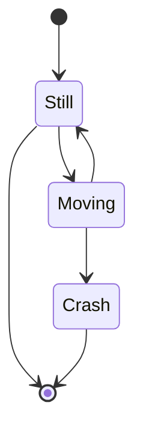

# Introduction

This document will walk you through the implementation of the "Posts - redux" feature.

The feature integrates Redux for state management in the posts component.

We will cover:

1. Why we use <SwmToken path="/src/components/redux/store/redux.store.js" pos="12:8:8" line-data="export const store = legacy_createStore(appReducers, applyMiddleware(thunk));">`legacy_createStore`</SwmToken> and <SwmToken path="/src/components/redux/store/redux.store.js" pos="12:13:13" line-data="export const store = legacy_createStore(appReducers, applyMiddleware(thunk));">`applyMiddleware`</SwmToken>.
2. How the store is configured with reducers and middleware.

# Store configuration

<SwmSnippet path="/src/components/redux/store/redux.store.js" line="12">

---

We configure the Redux store using <SwmToken path="/src/components/redux/store/redux.store.js" pos="12:8:8" line-data="export const store = legacy_createStore(appReducers, applyMiddleware(thunk));">`legacy_createStore`</SwmToken> and <SwmToken path="/src/components/redux/store/redux.store.js" pos="12:13:13" line-data="export const store = legacy_createStore(appReducers, applyMiddleware(thunk));">`applyMiddleware`</SwmToken>. This setup is crucial for managing the state and handling asynchronous actions.

```javascript
export const store = legacy_createStore(appReducers, applyMiddleware(thunk));
```

---

</SwmSnippet>

- <SwmToken path="/src/components/redux/store/redux.store.js" pos="12:8:17" line-data="export const store = legacy_createStore(appReducers, applyMiddleware(thunk));">`legacy_createStore(appReducers, applyMiddleware(thunk))`</SwmToken>:
  - <SwmToken path="/src/components/redux/store/redux.store.js" pos="12:10:10" line-data="export const store = legacy_createStore(appReducers, applyMiddleware(thunk));">`appReducers`</SwmToken>: Combines all the reducers for the application.
  - <SwmToken path="/src/components/redux/store/redux.store.js" pos="12:13:16" line-data="export const store = legacy_createStore(appReducers, applyMiddleware(thunk));">`applyMiddleware(thunk)`</SwmToken>: Adds middleware to handle asynchronous actions.

This configuration ensures that our Redux store is set up with the necessary reducers and middleware to manage the state effectively.

&nbsp;

&nbsp;



<SwmMeta version="3.0.0" repo-id="Z2l0aHViJTNBJTNBaGUtZ3VpZGUtdG8tbW9kZXJuLXJlZHV4JTNBJTNBaGVzYW1oYWJpYmlo" repo-name="he-guide-to-modern-redux"><sup>Powered by [Swimm](https://app.swimm.io/)</sup></SwmMeta>
